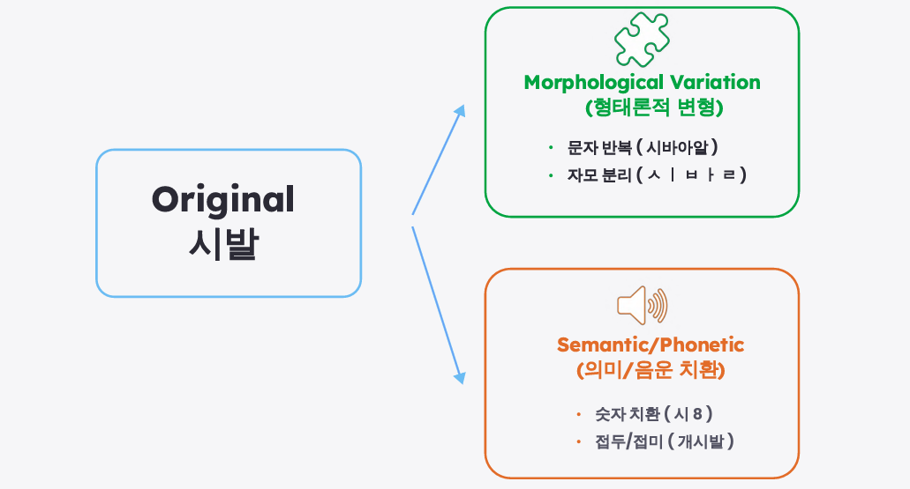
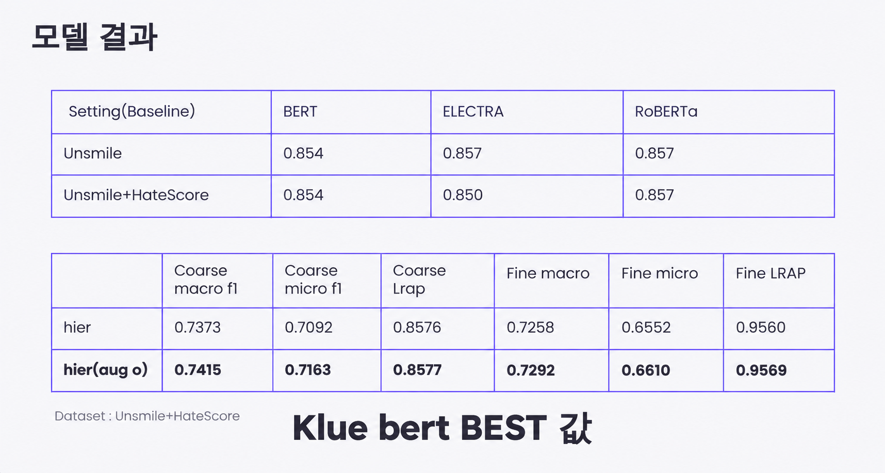

# Korean Hate Speech Detection

**Multi-label Korean NLP Classification with PLM Comparison, HITL Data, Robustness Augmentation, and Hierarchical Modeling**

This project explores context-aware Korean online hate-speech classification using pretrained language models, UnSmile + HateScore data, robustness-oriented augmentation, and flat vs. hierarchical prediction structures.

> **Task:** Korean online text → coarse toxicity class + fine-grained hate categories

## Project Overview

- **Period:** 2025
- **Task:** Korean online hate-speech / abusive-language classification
- **Datasets:** UnSmile + HateScore
- **Models:** BERT, ELECTRA, RoBERTa
- **Framework:** PyTorch + Hugging Face Transformers
- **Evaluation:** Macro F1, Micro F1, LRAP
- **Experiments:** PLM comparison, HITL data integration, Hybrid Lexicon augmentation, Flat vs. Hierarchical modeling

## Motivation

Online hate speech can target multiple social groups at the same time, while abusive or controversial expressions may also be neutral depending on context. A simple hate/non-hate classifier therefore cannot fully represent the structure of Korean online hate speech.

The project focuses on multi-label classification and robustness to intentionally obfuscated expressions, with the eventual application of filtering abusive chat content.

## Dataset

The experiments combine two Korean hate-speech datasets:

- **UnSmile** — Korean hate-speech data with hate-target labels, abusive-language examples, and clean text.
- **HateScore** — approximately 11K auxiliary examples built around Human-in-the-Loop labeling and neutral examples, including Wikipedia-derived and rule-generated neutral sentences.

The combined dataset was used to examine whether additional neutral/context-sensitive examples could reduce false hate predictions. The label schema was reconciled during dataset integration for the project experiments.

Large raw datasets are not included in this repository. Place the required files under the corresponding experiment `data/` directory before running the scripts.

## Baseline PLM Experiments

The baseline stage compared Korean pretrained language models:

- BERT
- ELECTRA
- RoBERTa

Hyperparameter exploration in the project covered:

- **Epochs:** 3–6
- **Learning rate:** 1e-5–5e-5
- **Batch size:** 16 or 32

Recorded baseline scores:

| Dataset | BERT | ELECTRA | RoBERTa |
| --- | ---: | ---: | ---: |
| UnSmile | 0.854 | 0.857 | 0.857 |
| UnSmile + HateScore | 0.854 | 0.850 | 0.857 |

The final hierarchical/augmentation experiments used KLUE BERT as the selected backbone.

## HITL Experiment

HateScore was introduced to examine the effect of Human-in-the-Loop and neutral-data expansion. The project presentation showed examples where the additional data helped correct keyword-driven errors and improved predictions for some contextually complex multi-label cases.

At the aggregate level, however, the baseline comparison did not show a clear universal gain from simply adding HateScore. The HITL result is therefore interpreted as a context/decision-boundary experiment rather than a blanket performance improvement.

## Hybrid Lexicon Construction

Instead of relying on large-scale additional crawling, the project constructed an enhanced lexicon from two sources:

1. **Manual lexicon** — predefined abusive expressions and category information.
2. **Auto-mined seeds** — frequency-derived candidate expressions extracted from data.

The two sources are merged through deduplication and filtering, including removal of unsuitable numeric/general-noun candidates. This allows the augmentation pipeline to capture variants that were absent from the initial manual lexicon.

## Robustness-oriented Augmentation

The final presentation defines four main obfuscation strategies:

- **Character repetition** — repeated characters used to distort abusive expressions.
- **Hangul/Jamo decomposition** — splitting syllables into consonant/vowel components.
- **Numeric substitution** — replacing part of an expression with numbers.
- **Prefix/suffix variation** — attaching or modifying surrounding morphemes.

These rules are designed to improve robustness to spelling variation and intentional obfuscation in online text. The implementation is available in `experiments/augmentation/src/augment.py`.

<p align="center">
  
</p>

## Flat vs. Hierarchical Classification

The final stage compares two prediction structures.

### Flat model

- coarse prediction head
- fine-grained multi-label prediction head
- combined coarse cross-entropy + fine binary cross-entropy loss

### Hierarchical model

The hierarchical model adds a coarse–fine consistency term to the classification objective. `lambda_fine` controls the contribution of the fine-label loss, while `lambda_hier` controls the strength of the coarse–fine consistency penalty.

The current public implementation uses a differentiable probability-based consistency loss so that the hierarchical term contributes to gradient updates.

## Evaluation

The original project used **F1-score** and **LRAP (Label Ranking Average Precision)** as the main evaluation measures. LRAP evaluates how highly the model ranks the ground-truth labels and is particularly useful for the fine-grained multi-label task.

For comparability with the recorded project experiments, LRAP is retained for both coarse and fine results. In the current code, coarse classification is evaluated as a single-label multiclass task using argmax-based Accuracy/Macro F1/Micro F1, while coarse LRAP is additionally reported from class probabilities. Fine-grained classification remains threshold-based multi-label evaluation with Macro F1, Micro F1, LRAP, Hamming Loss, and Jaccard metrics.

## Results

### Flat vs. Hierarchical Modeling

| Setting | Coarse Macro F1 | Coarse Micro F1 | Coarse LRAP | Fine Macro F1 | Fine Micro F1 | Fine LRAP |
| --- | ---: | ---: | ---: | ---: | ---: | ---: |
| Flat | 0.7395 | **0.7188** | **0.8584** | 0.7073 | 0.6915 | **0.9603** |
| Hierarchical | 0.7373 | 0.7092 | 0.8576 | 0.7258 | 0.6552 | 0.9560 |
| Flat + Augmentation | 0.7299 | 0.7094 | 0.8519 | 0.7085 | **0.6976** | — |
| Hierarchical + Augmentation | **0.7415** | 0.7163 | 0.8577 | **0.7292** | 0.6610 | 0.9569 |

<p align="center">
  
</p>

### Interpretation

- **Hierarchical + augmentation achieved the highest recorded Coarse Macro F1 (0.7415) and Fine Macro F1 (0.7292).**
- Compared with the hierarchical model without augmentation, augmentation increased Coarse Macro F1 from 0.7373 to 0.7415 and Fine Macro F1 from 0.7258 to 0.7292.
- Flat modeling retained the highest recorded Coarse Micro F1, Coarse LRAP, and Fine LRAP.
- Flat + augmentation recorded the highest Fine Micro F1 among the four final settings.
- Augmentation therefore did not improve every metric uniformly; the results show a trade-off between per-category balance, global prediction performance, and ranking quality.

These values are the recorded results from the final project presentation. The public repository has since received code-quality and training-stability fixes, so rerunning the current code may not reproduce the historical values exactly.

## Demo

The project also included a web demo for abusive-chat filtering, connecting the trained classifier to an interactive chat interface and visualizing detected categories.

## Repository Structure

```text
korean-hate-speech-detection/
├── README.md
├── augmentation_rules.png
├── model_results.png
├── requirements.txt
├── config/
│   └── base.yaml
├── src/
│   ├── dataset.py
│   ├── metrics.py
│   ├── models.py
│   ├── trainer.py
│   └── infer.py
├── docs/
│   ├── augmentation.md
│   └── results.md
└── experiments/
    ├── baseline/
    │   ├── config/
    │   │   └── text_classification.yaml
    │   ├── scripts/
    │   │   ├── train_baseline.py
    │   │   └── inference.py
    │   └── utils/
    └── augmentation/
        ├── config/
        │   └── base.yaml
        ├── train_flat.py
        ├── train_hier.py
        ├── infer.py
        └── src/
            ├── augment.py
            ├── dataset.py
            ├── metrics.py
            ├── models.py
            ├── trainer.py
            └── utils.py
```

## Installation

```bash
pip install -r requirements.txt
```

## Running the Experiments

Prepare the required datasets in each experiment's `data/` directory first.

```bash
python experiments/baseline/utils/build_combined_dataset.py
python experiments/baseline/scripts/train_baseline.py
```

For the augmentation experiments:

```bash
python experiments/augmentation/train_flat.py
python experiments/augmentation/train_hier.py
```

The augmentation scripts resolve configuration, dataset, log, and checkpoint paths relative to `experiments/augmentation/`.

## Notes

- Large datasets, model checkpoints, training logs, and large lexical resource files are excluded from the repository.
- The repository contains preprocessing, PLM baseline experiments, augmentation, flat/hierarchical training, evaluation, and inference code used across the project experiments.
- Recorded presentation metrics are preserved as historical experimental results; current code-quality fixes are not presented as reruns of those experiments.

## Tech Stack

`Python` `PyTorch` `Transformers` `scikit-learn` `Pandas` `BERT` `ELECTRA` `RoBERTa` `Multi-label Classification` `NLP`
